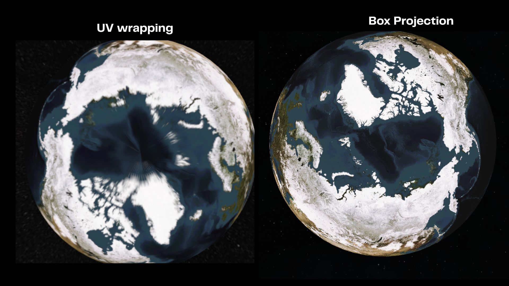

# SatDeck – Design Overview

This guide will cover the following topics:

1. [Using your own TLE data & live cloud updates](#using-your-own-tle-data--live-cloud-updates)
2. [How data is generated from TLEs](#how-data-is-generated-from-tles)
3. [How the 3D view works](#how-the-3d-view-works)

If you find a bug or want to suggest a feature, please open a GitHub Issue.

---

## Using your own TLE data & live cloud updates

All satellite orbit data is stored in:
[Backend/tledata.txt](Backend/tledata.txt)

It uses the standard TLE format to store data which looks like this :
```
ISS (ZARYA)             
1 25544U 98067A   25362.53357479  .00015441  00000+0  27889-3 0  9992
2 25544  51.6321  64.2558 0003250 314.4858  45.5864 15.49907133545304
SWAS                    
1 25560U 98071A   25362.25244539  .00007080  00000+0  46409-3 0  9995
2 25560  69.8971 307.8719 0005513 194.7614 165.3390 15.08099532471484

```

The format is :
- Satellite name to be on the first line.
- TLE line 1 on the second line.
- TLE line 2 on the third line.
- And then continue with the next satellite TLE.

The [tlefetcher.js](Backend/tle_fetcher.js) handels the fetching and parsing to the tle data.
The file has two very simple functions fetchtle() and parseTLE()

```js

async function fetchtle() {
    const res = await fetch("./Backend/tledata.txt");

    if (!res.ok) {
        console.error("Failed to load local TLE file:", res.status);
        return;
    }

    return await res.text();
}


// Final function that provides the website with an array of satellite object
function parseTLE(rawData) {
    console.log("starting to parse data");
    const lines = rawData.split("\n").map(l => l.trim()).filter(l => l !== "");
    const satellites = [];

    for (let i = 0; i < lines.length; i += 3) {

        // Extracting details from the lines
        const name = lines[i];
        const line1 = lines[i + 1];
        const line2 = lines[i + 2];

        if (!line1 || !line2) continue; // Skip incomplete entries

        // Extract NORAD ID from line1 (characters 2-7)
        const noradId = line1.slice(2, 7).trim();

        satellites.push({ name, noradId, line1, line2 });
    }

    console.log("Parsed data successfully.");
    return satellites;
}
}
```
They do exactly what their name suggests,  fetchtle() fetches the tle from a local file and parseTLE() parses the fetched data provided by the fetchtle().
The parseTLE() takes the raw tle data and then stores it in an array of objects to be later used by all the differnent files.

### How to use a server to make it a live satellite tracking tool.
Now in this section I will show you what data to fetch and feed the app rather than actually show you how to setup a server for this.

Originally SatDeck was designed to be worked with cloudflare databse and workers and it did have live satellite updates but with some major issues which is why I made is load tle data from a local file.

To get the TLEs from a server database you will need edit the fetchtle() function as it's responsible for fetching the data the fetchtle() function is an async and the entier app is designed in a way such that only when the fetchtle() function returns the tles rest of the functions will run so it is built for fetching tle data from the cloud.


This project can optionally load live TLE data from public providers such as CelesTrak.
You make take the tles from sites like Celstrack which I originally did.
```
https://celestrak.org/NORAD/elements/gp.php?GROUP=active&FORMAT=tle
```
CelesTrak offers a list of more than 14,000 active satellites (as of December 2025).  
However, their servers enforce strict rate limits. If you fetch data too frequently
from the same IP address (for example 100+ requests in a short time), your IP may be
temporarily blocked for several hours.

You may use any other TLE provider as long as the data follows the standard TLE format
described above.


#### Backend Recommendation

For your project, it is strongly recommended to store TLE data on your own server.

Suggested workflow:

- Store raw TLE data in a simple `.txt` file on a backend service  
  (Firebase, Supabase, Cloudflare Workers, or any custom server).
- Expose the file through a public API endpoint.
- Apply basic rate limiting if needed.
- Fetch the data from this endpoint inside the app and pass it directly into `fetchtle()`.

SatDeck expects raw `.txt` TLE data, so serving the file without modification is both
the simplest and the most efficient solution.

---

## How data is generated from TLEs

Before reading this section, it is recommended that you first read  
**“Using your own TLE data & live cloud updates”** to understand how the TLEs are loaded in the first place.

SatDeck uses the JavaScript library:
[satellite.js](https://github.com/shashwatak/satellite-js) to decode raw TLE data and
convert it into meaningful data such as satellite position, velocity,
and ground track.

Most of this processing is handled inside:

[Backend/satellitecalculator.js](Backend/satellitecalculator.js)

This file takes the parsed TLE objects and feeds them into the satellite.js SGP4 model,
which produces real-time Earth-Centered Inertial (ECI) coordinates. These values are
stored in internal variables and used throughout the application.

If you want to understand how the TLE decoding works in detail, refer to the official
documentation of the satellite.js library, which fully explains the SGP4 workflow and
usage patterns.

---

## How the 3D view works

In this section I am going to cover how the earth and the orbit is being rendered.

So I am using THREE.js for handeling all of our 3D stuff. I am using CDN packages to lead the THREE.js in our project:

```js
import * as THREE from "https://cdn.jsdelivr.net/npm/three@0.178.0/build/three.module.js";
```

Also I am using another extrnal THREE.js tool called [camera-controls](https://github.com/yomotsu/camera-controls) this will help us with the orbiting of the earth as it has sligtly more features thatn the default THREE.js orbit controls.

The the 3D scene is divided into many files the earth is being rednered in [RenderEarth.js](Earth_Window/RenderEarth.js) .

To render the earth you will need a sphere mesh of any kind a icosphere or a uvsphere won't make any difference here as we are using box projection for applying the texture on the sphere.
Make sure to get a proper earth texture something like the nasa blue marble image as they are designed for this [Link to the image](https://science.nasa.gov/earth/earth-observatory/blue-marble-next-generation/base-map/).

Box projection helps us prevent the streching across the poles. 
  

You will need to split the image in a cubemap you can use any panaromic to cubemap image generator I used [this](https://jaxry.github.io/panorama-to-cubemap/) website to generate mine.

Now Three.js by default dosen't really have any material or shader that would fit our use case hrer so I had to use my own shader 

```js
 const Earth_Material = new THREE.ShaderMaterial({
    uniforms: {
      cubeMap: { value: earthCube },
  earthRot: { value: new THREE.Matrix3() }
    },

    vertexShader: `
uniform mat3 earthRot;
varying vec3 vDir;

void main() {
  vec3 worldDir = (modelMatrix * vec4(position, 1.0)).xyz;
  vDir = normalize(earthRot * worldDir);
  gl_Position = projectionMatrix * modelViewMatrix * vec4(position,1.0);
}


    `,

    fragmentShader: `
     uniform samplerCube cubeMap;
varying vec3 vDir;

vec3 toSRGB(vec3 color) {
  return pow(color, vec3(1.0/2.2));
}

void main() {
  vec3 col = textureCube(cubeMap, normalize(vDir)).rgb;
  gl_FragColor = vec4(toSRGB(col), 1.0);
}

    `
  });
```

I took ChatGPT's help to generate this shader. Have no idea how this works, never wrote shader code.

After rendering the earth we need to render the path.

The Path rendering code is in [RenderOrbit.js](Earth_Window/Modules/RenderOrbit.js).

The Path rendering logic is simple.
We take any satellite and render its position for every 30 second for the given path duration. so if the given path duration is 10 mins then the no. of position points generated will be 10*2 = 20 so a total of 20 points which will be passed to the [DeploySatellite.js](Earth_Window/Modules/DeploySatellite.js) to be rendered in the 3D window.

```js
  
export async function calculateOrbitPath(
    noradId,
    durationMinutes = 200,
    stepSeconds = 30,
    mode = "both"   // "forward", "backward", "both"
) {
    const tledata = satellites_map_array.find(sat => sat.noradId === noradId);
    if (!tledata) throw new Error(`No TLE found for NORAD ID: ${noradId}`);

    const satrec = satellite.twoline2satrec(tledata.line1, tledata.line2);
    const segments = [];
    let segment = [];
    const now = new Date();

    // Determine time range based on mode
    let start, end;

    if (mode === "both") {
        start = -durationMinutes * 60;
        end   =  durationMinutes * 60;
    } else if (mode === "forward") {
        start = 0;
        end   = durationMinutes * 60;
    } else if (mode === "backward") {
        start = -durationMinutes * 60;
        end   = 0;
    }

    for (let t = start; t <= end; t += stepSeconds) {
        const futureTime = new Date(now.getTime() + t * 1000);
        const pv = satellite.propagate(satrec, futureTime);
        if (!pv.position) continue;

        const gmst = satellite.gstime(futureTime);
        const geo = satellite.eciToGeodetic(pv.position, gmst);
        const lat = satellite.degreesLat(geo.latitude);
        const lon = satellite.degreesLong(geo.longitude);
        const alt = geo.height;

        segment.push(LatLonAltToXYZ(lat, lon, alt));
    }

    segments.push(segment);
    return segments; // array of arrays of Vector3
}
```

By default the stepSecond value is set to 30 which means it will render a position for every 30 second is the given given path duration you can lower it to get a more detailed path or increase it to get a lower detail.


Again,
If you find a bug or want to suggest a feature, please open a GitHub Issue.
