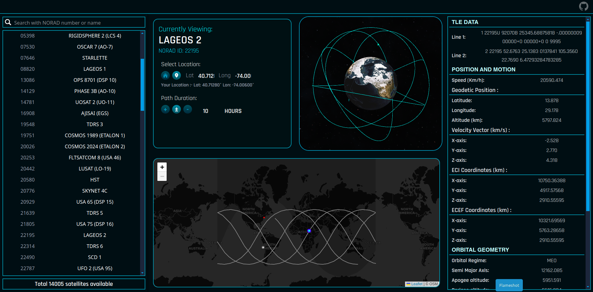
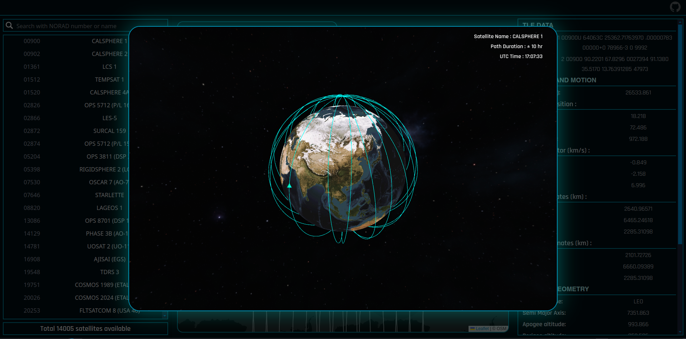
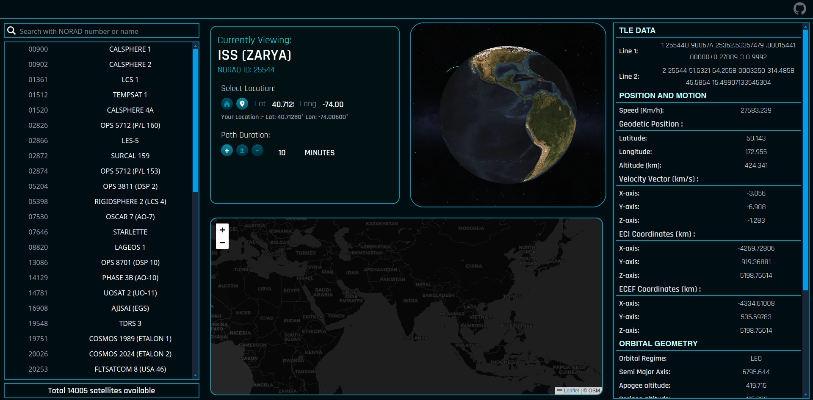

# SATDECK

SatDeck is a desktop-first 3D satellite tracking and visualization tool built with JavaScript and Three.js.

The project was originally aimed to become a fully-featured satellite tracking platform similar to  
n2yo.com, satellitemap.space and other public trackers.

It loads **Two-Line Element (TLE)** data from a local `.txt` file and visualizes satellite orbits around Earth in real time.  
Optionally, TLEs can be fetched from public sources such as CelesTrak, making it a live satellite tracking tool.

---

## Preview
  
  

---

##  How to Run

### 1. Clone the repository

```bash
git clone https://github.com/YOUR_USERNAME/satdeck.git
cd satdeck
``` 

### 2. Start a local server

Run any local web server. The easiest way is using Python:

```bash
python -m http.server
```

### 3. Open the browser and you are good to go.

NOTE: Don't directly open the .html file it won't work.

If everything is working, you should see something like this:

  

If you want to learn about the working of the webapp and customize it then refer to the design overview .
[Design_overview.md](DESIGN_OVERVIEW.md)

## License

MIT License

